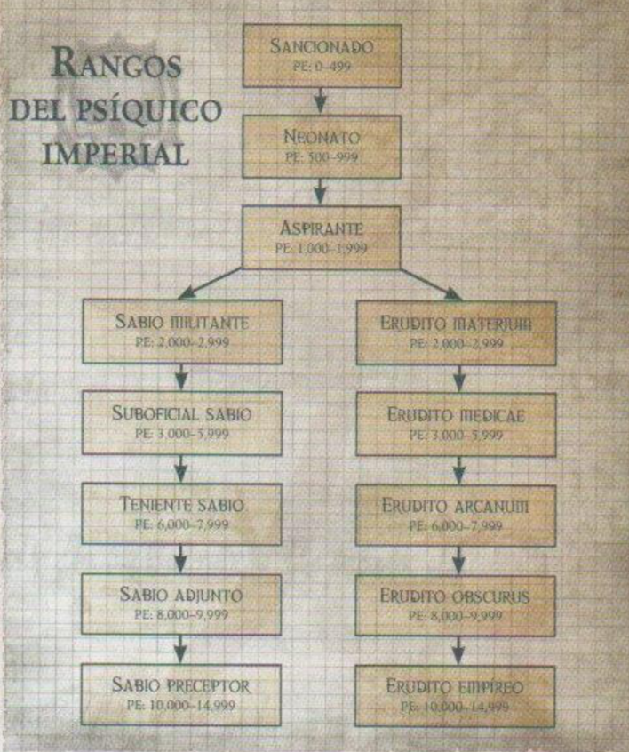

#Características y atributos

##Características

- **39** (HA) Habilidad de Armas
- **29** (HP) Habilidad de Proyectiles
- **31** (F) Fuerza
- **31** (R) Resistencia
- **38** (AG) Agilidad
- **30** (INT) Inteligencia
- **30** (PER) Percepción
- **52** (V) Voluntad (42 +5 +5)
- **29** (EM) Empatía

##Habilidades

- **Hablar idioma** (Gótico vulgar) (INT)
- **Hablar idioma** (Dialecto nave) (INT)
- **Leer/Escribir** (Gótico vulgar) (INT)
- **Oficio** (Adivino) (EM)

		Se usa para dar la impresión de estar prediciendo el futuro.
		Me lleva un día entero ganar dinero usando esta habilidad.
	
- **Invocación** (V)

		Permite incrementar la tirada de Poder que deba realizar para usar un poder psíquico en una cantidad equivalente a mi Bono por Voluntad.
		Cada tirada consume una acción completa, durante la cual recurro a diversas técnicas para despejar mi mente, como musitar mantras, meditar, acariciar mi foco psíquico y demás.
		Un éxito en la tirada indique que he preparado mi mente para acceder a la disformidad, y en el asalto siguiente podré añadir mi Bono por Voluntad (además de cualquier otro bono pertinente) a mi tirada de Poder.
		Fallar una tirada de Invocación significa que no estoy lo bastante concentrado.
	
- **Psiniscencia** (PER) (p.106)

		Puede usarse para sintonizar con las fluctuaciones de la disformidad y el inmaterium. La aplicación más común de esta habilidad consiste en detectar la presencia o asuencia de demonios y de otros psíquicos.
		Si se consigue la tirada, logro proyectar mis sentidos a una distancia igual a mi bono de Percepción más 1d10 (metros). Cada nivel de éxito obtenido en la tirada añade 1d10+BP metros a ese total.
		También se puede usar Psiniscencia para detectar fenómenos psíquicos inusuales, zonas de espacio real que hayan sido "perturbadas", lugares que bloqueen o protejan contra el flujo del inmaterium, etc.
		El DJ puede hacer esta tirada en secreto y comunicar al jugador tan sólo lo que su personaje haya podido detectar.
	
	
	Niveles de éxito|Resultado
	---|---
	Normal|El personaje es consciente de que existe una perturbación en el inmaterium.
	Uno|EEl personaje localiza el punto de origen general del fenómeno.
	Dos o más|El personaje halla la ubicación exacta del individuo que está canalizando o bloqueando el inmaterium.
	

##Talentos y rasgos

- Entrenamiento con armas c/c (primitivas)
- Entrenamiento con pistolas (láser)
- Factor psíquico 1

		He liberado mi portencial psíquico.
		Elige tantos poderes psíquicos menores como la mitad de mi Bono de Voluntad (redondea hacia arriba) de entre los descritos en el "Capítulo VI: Poderes psíquicos".
		Obtengo un Factor psíquico de 1; puedo tirar 1 dado y sumar mi Bono por Voluntad al resultado para manifestar poderes psíquicos.
		
		Especial: Si mi bono aumenta más adelante, no ganaré poderes adicionales (no tiene efecto retroactivo)
		
- Acostumbrado al vacío
	
		Inmune a las náuseas que suelen provocar los viajes espaciales.
		Los entornos de gravedad cero o baja gravedad no se consideran terreno difícil para mí.
		
- Agorero

		Suscito el desprecio y la desconfianza de la mayoría.
		Soy propenso a atraer toda la atención negativa que genere el grupo de acólitos:
		Acusaciones cuando la leche se agría, mercaderes malhumorados, niños con puñados de heces de grox...
		
		Sufro una penalización de -5 a todas las tiradas de Empatía que tenga que hacer para intactuar con humanos no nacidos en el vacío.
		
- Familiarizado c/naves

		Afinidad natural a las naves.
		
		Orientación (Estelar) (INT) y Pilotar (Nave Espacial) (AG) se consideran habilidades básicas para mi.
		
- Venturoso

		Suerte sobrenatural.
		
		Cada vez que gaste 1 punto de Destino (pero no si lo sacrifico), tiro 1d10.
		Con 9 (natural) no perderé el punto de destino.
		
- Psíquico autorizado

##Otros atributos

- 11 Heridas
- 3 Puntos de destino
- 3 Metros por asalto
- 1 Locura

##Bonos

- Agorero (-5 a todas las tiradas de empatía contra humanos que no sean del vacío)
- Orientación estelar (Int), pilotar nave espacial (Agi) > se considera habilidad básica
- Cada vez que gaste 1 pto de destino (no sacrificando) tira 1-10. Si sacas un 9 natural (sin bonos), no pierdes el punto

##A gastar

- Experiencia total: 423
- Experiencia actual: 73
- Poderes psíquicos menores > La mitad del bono de voluntad redondeando hacia arriba (2)

##Mejoras

+5 Voluntad (100)
+5 Voluntad (250)
