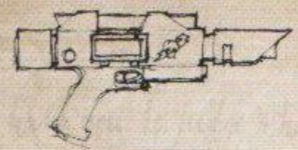

# Equipo

## Armas

### Pistola láser compacta

Tipo|Alcance|CDD|Daño|Pen|Car|Recarga|Especial|Peso|Precio
---|:---:|---|---|---|---|---|---|---|:---:
Pistola|30 m|T/-/-|1d10+2 E|0|30|Completa|Fiable|1'5 kg|50

La pistola láser es una arma ligera, compacta y fiable de uso muy extendido en todo el Imperio. Existen infinidad de diseños, desde elaboradas herencias familiares grabadas con intrincadas tallas y filigranas de oro hasta las armas más simples pero brutales que suelen usar pandilleros y criminales.

- `+ 1 batería`
	Las baterías láser pueden recargarse en el campo de batalla empleando casi cualquier tipo de fuente de energía. Los personajes pueden hacer una tirada de Competencia tencológica para recargar cualquier batería si cuentan con una fuente de energía apropiada. El tiempo que tarda una batería en recargarse depende de la salida de potencia de la fuente y suele dejarse a discrección del DJ, pero lo más normal es que tarde varias horas. Ocasionalmente, las baterías se pueden recargar arrojándolas al fuejo: sin embargo, esto tarda al menos un día y además reduce permanentemente la capacidad del cargador a la mitad (pero sólo la primera vez que se recarga de este modo); también elimina la propiedad "Fiable" del arma (si no la tenía, el arma recible la propiedad "Poco fiable"). Cada vez que se recargue una batería poniéndola en el fuego existe una probabilidad del 30% de que se estropee permanentemente y no pueda volver a usarse.

### Bastón

Tipo|Alcance|Daño|Pen|Especial|Peso|Precio
---|:---:|---|---|---|---|:---:
C/C|-|1d10 I|0|Equilibrada, Primitiva|3 kg|10

- `Equilibrada` +10 a la tirada de Habilidad de Armas
- `Primitiva` menos efectiva contra armaduras modernas (p.129)

### Espada

Tipo|Alcance|Daño|Pen|Especial|Peso|Precio
---|:---:|---|---|---|---|:---:
C/C|-|1d10 A|0|Equilibrada, Primitiva|3 kg|15

- `Dos manos` Se han de usar las dos manos
- `Equilibrada` +10 a la tirada de Habilidad de Armas
- `Primitiva` menos efectiva contra armaduras modernas (p.129)

### Cuchillo (puñal de muerte piadosa)

Tipo|Alcance|Daño|Pen|Especial|Peso|Precio
---|:---:|---|---|---|---|:---:
Arrojadiza, C/C|3m|1d5 A|0|Primitiva|0'5 kg|5

- `Primitiva` menos efectiva contra armaduras modernas (p.129)

## Ropa / Armadura

Chaleco acolchado y túnica raída

### Chaleco acolchado

Localizaciones protegidas|PB|Peso|Precio
---|---|---|:---:
Cuerpo|2|2 kg|10

### Túnica raída

## Dinero

- **51** tronos de oro
- `Ingresos mensuales de 70 tronos de oro`

##Otros

- Baraja tarot imperial
- Foco psíquico (+10 a invocación) **A decidir**
- Marca de autorización

##Compras

- Arnés de seguridad (25)
- Filtros nasales (15)
- Mochila (10)
